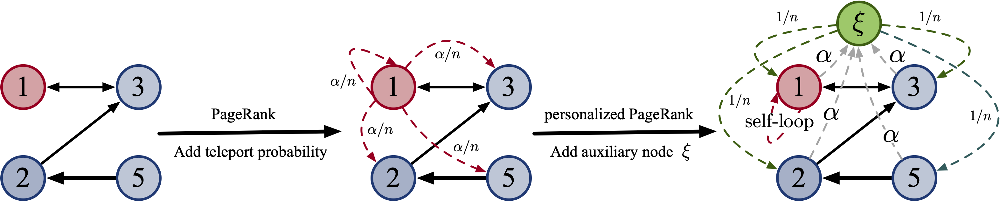
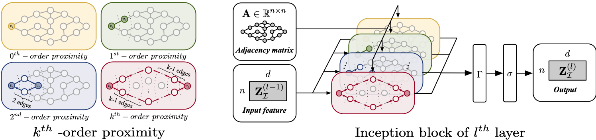
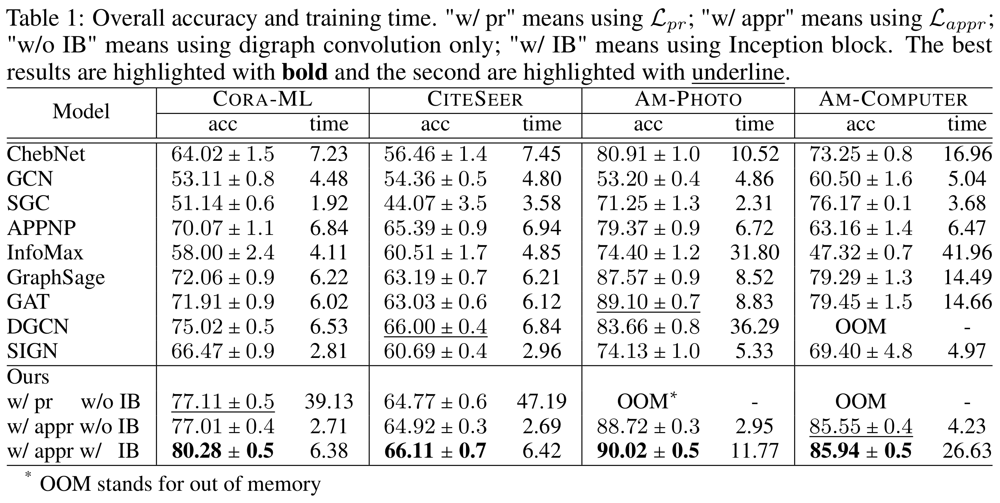

# Digraph Inception Convolutional Networks
**[Paper](https://papers.nips.cc/paper/2020/file/cffb6e2288a630c2a787a64ccc67097c-Paper.pdf)** | **[Poster](https://github.com/flyingtango/DiGCN/blob/main/docs/digcn_poster.pdf)** 
This repository is the official PyTorch implementation of [Digraph Inception Convolutional Networks](https://papers.nips.cc/paper/2020/file/cffb6e2288a630c2a787a64ccc67097c-Paper.pdf), where we make GCNs available in digraphs (directed graphs) and propose an Inception network to learn multi-scale features in digraphs.


<center>Illustration of digraph conv</center>
<center></center>

&nbsp;
<center>Illustration of DiGCN model</center>
<center></center>
&nbsp;

If you find our work useful, please considering citing

```
@article{tong2020digraph,
  title={Digraph Inception Convolutional Networks},
  author={Tong, Zekun and Liang, Yuxuan and Sun, Changsheng and Li, Xinke and Rosenblum, David and Lim, Andrew},
  journal={Advances in Neural Information Processing Systems},
  volume={33},
  year={2020}
}
```

## Requirements

Our project is developed using Python 3.7, PyTorch 1.5.0 with CUDA10.2. We recommend you to use [anaconda](https://www.anaconda.com/) for dependency configuration.

First create an anaconda environment called ```DiGCN``` by

```shell
conda create -n DiGCN python=3.7
conda activate DiGCN
```

Then, you need to install torch manually to fit in with your server environment (e.g. CUDA version). For the torch and torchvision used in my project, run

```shell
conda install pytorch==1.5.0 torchvision==0.6.0 cudatoolkit=10.2 -c pytorch
```

Besides, torch-scatter and torch-sparse are required for dealing with sparse graph. 
For these two packages, please follow their official instruction [torch-scatter](https://github.com/rusty1s/pytorch_scatter) and [torch-sparse](https://github.com/rusty1s/pytorch_sparse).


Other requirements can be set up through:

```shell
cd DiGCN
pip install -e .
```
## Run

```shell
cd code
python gcn.py --gpu-no 0 --dataset cora_ml
python digcn.py --gpu-no 0 --dataset cora_ml
```

## Results

<center></center>

## License

DiGCN is released under the MIT License. See the LICENSE file for more details.

## Acknowledgements

The template is borrowed from Pytorch-Geometric benchmark suite. We thank the authors of following works for opening source their excellent codes.
[Pytorch-Geometric](https://github.com/rusty1s/pytorch_geometric)
[Graph2Gauss](https://github.com/abojchevski/graph2gauss)
[GNN-benchmark](https://github.com/shchur/gnn-benchmark)

